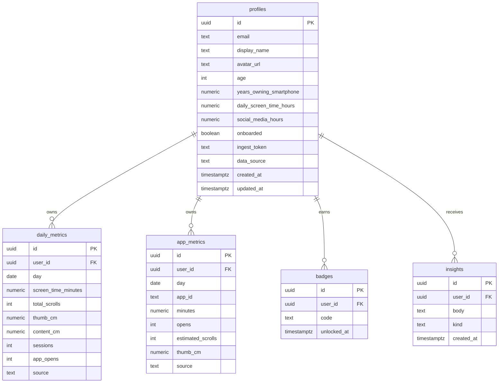

<p align="center">
  
</p>

<h1 align="center">ScrollMiles</h1>

<p align="center">
  <strong>Spotify Wrapped × Apple Health for scrolling.</strong><br />
  Discover how many miles your thumb has traveled across your smartphone life.
</p>

<p align="center">
  <a href="#"></a>
  <a href="#"></a>
  <a href="#"></a>
  <a href="#"></a>
  <a href="#"></a>
  <a href="#"></a>
  <a href="#"></a>
</p>

<p align="center">
  <a href="https://lovable.dev">Lovable project</a> ·
  <a href="#installation">Installation</a> ·
  <a href="#architecture">Architecture</a> ·
  <a href="#security">Security</a>
</p>

> **Demo:** This repository is connected to Lovable. Use your deployed Lovable URL when available.

---

## Overview

Modern screen time tools tell you **how long** you were on your phone. ScrollMiles answers a more memorable question: **how far did your thumb travel?**

ScrollMiles combines a transparent estimation engine, authenticated dashboards, web scroll capture, companion-app ingestion hooks, achievements, app breakdowns, and AI-generated summaries to turn everyday scrolling into clear, shareable analytics.

### Why it exists

- **Screen time is abstract.** Minutes and hours are hard to feel.
- **Distance is intuitive.** Thumb miles make digital behavior tangible.
- **Users deserve context.** ScrollMiles labels data as estimated, verified, or mixed and explains what powers each number.

---

## Features

| Area | Capability | Current implementation |
| --- | --- | --- |
| Landing experience | Polished hero, conversion CTA, SEO metadata | Public `/` route with motion-enhanced marketing copy |
| Authentication | Google sign-in | Lovable Cloud Auth + Supabase session handling |
| Dashboard | Personalized analytics workspace | Protected `/dashboard` route with sidebar, header, stats, charts, insights, calculator, and activity panels |
| Scroll tracking | Best-effort web activity capture | Wheel/touch listeners aggregate scrolls, thumb centimeters, content centimeters, and active seconds |
| Estimation engine | Lifetime thumb miles and content miles | Deterministic calculator based on age, smartphone years, daily screen time, and social usage |
| Verified data | Companion-app ingestion path | Public API endpoint accepts Android/iOS metrics with a per-user ingest token |
| Data labels | Estimated, verified, or mixed source badges | Profile-level `data_source` field controls dashboard messaging |
| App usage | Per-app metrics | `app_metrics` table stores app id, minutes, opens, scroll estimates, and thumb distance |
| Achievements | Badge unlocking | Server function unlocks milestones such as First Mile, Scroll Marathon, and Endless Feed Survivor |
| AI insights | Personalized summaries | Lovable AI Gateway generates short weekly observations from recent metrics |
| Persistence | User profiles and metrics | Supabase Postgres schema with row-level security policies |
| UI system | Accessible components | Radix UI primitives, shadcn-style components, Tailwind CSS, Recharts, and Lucide icons |

### Feature maturity

| Capability | Status | Notes |
| --- | --- | --- |
| Estimated lifetime calculations | ✅ Implemented | Works from profile calculator inputs |
| Authenticated dashboard | ✅ Implemented | Requires Supabase/Lovable configuration |
| Web scroll capture | ✅ Implemented | Best-effort browser events, flushed to Supabase |
| Android/iOS ingest endpoint | 🧩 API ready | Companion apps can post verified metrics |
| AI insight generation | ✅ Implemented | Requires `LOVABLE_API_KEY` |
| Rich app-store style screenshots | 🚧 Pending repository assets | No screenshot files are currently committed; add them under `docs/`, `public/`, or repository assets |

---

## Screenshots

No screenshot image files were found in the committed repository at the time this README was generated. The repository now includes a lightweight vector brand asset for the hero section:

<p align="center">
  
</p>

<details>
<summary>Recommended screenshot gallery layout</summary>

When production screenshots are added, place them in `docs/screenshots/` or `public/` and replace this section with a gallery like:

| Landing | Dashboard | Analytics |
| --- | --- | --- |
| `docs/screenshots/landing.png` | `docs/screenshots/dashboard.png` | `docs/screenshots/analytics.png` |

Suggested captures:

1. Landing page hero with the “Get my ScrollMiles” CTA.
2. Authenticated dashboard overview.
3. Scroll activity chart and top apps panel.
4. Achievements and AI insights sections.

</details>

---

## How It Works

### 1. Scroll tracking

ScrollMiles tracks web activity from authenticated dashboard sessions by listening to `wheel`, `touchstart`, `touchmove`, and `touchend` events. It converts movement from pixels to centimeters using device pixel ratio and a 96 DPI baseline, aggregates events locally, then flushes metrics every 20 seconds or when the page is hidden.

### 2. Analytics engine

The calculator estimates lifetime metrics from four inputs:

- Age
- Years owning a smartphone
- Daily screen-time hours
- Social-media hours

It calculates daily scrolls, total scrolls, thumb distance, content distance, lifetime screen hours, and streak-like summary values using transparent constants in the ScrollMiles engine.

### 3. Verified data ingestion

A future companion mobile app can post daily Android/iOS usage metrics to `/api/public/ingest`. The endpoint validates payloads with Zod, authenticates via a per-user `ingest_token`, upserts daily and per-app metrics, and marks the profile as verified.

### 4. Insights generation

Authenticated users can generate AI insights. The server gathers recent profile, daily, and app metrics, sends a bounded summary to the Lovable AI Gateway, parses short insight strings, and stores them in Supabase.

### 5. Achievement system

Badges unlock from total thumb miles and total scroll counts. Current milestones include:

| Badge code | Label | Unlock condition |
| --- | --- | --- |
| `first_mile` | First Mile | 1+ thumb mile |
| `scrolls_100k` | 100K Scrolls | 100,000+ scrolls |
| `scroll_marathon` | Scroll Marathon | 26.2+ thumb miles |
| `thumb_athlete` | Thumb Athlete | 100+ thumb miles |
| `endless_feed` | Endless Feed Survivor | 1,000,000+ scrolls |

---

## Tech Stack

| Layer | Technology | Purpose |
| --- | --- | --- |
| Framework | React 19 + TanStack Start | SSR-capable app shell, server functions, file-based routing |
| Language | TypeScript | Type-safe frontend, server functions, and Supabase types |
| Routing | TanStack Router | Public, auth, protected, and API routes |
| Data fetching | TanStack Query | Dashboard query/mutation state |
| Database/Auth | Supabase | Postgres, Auth, RLS, generated database types |
| Cloud auth | Lovable Cloud Auth | Google OAuth integration |
| AI | Lovable AI Gateway | Weekly insight generation |
| Styling | Tailwind CSS 4 | Utility-first responsive design system |
| UI primitives | Radix UI | Accessible headless components |
| Charts | Recharts | Scroll activity visualizations |
| Animation | Motion | Landing/auth polish |
| Validation | Zod | Server function and API request validation |
| Build tooling | Vite + Lovable TanStack config | Development, production build, and deployment integration |
| Icons | Lucide React | Dashboard and marketing iconography |

### Repository statistics

| Metric | Count |
| --- | ---: |
| TypeScript / TSX files | 81 |
| UI and dashboard component files | 56 |
| Route files | 6 |
| Supabase migrations | 2 |

---

## Architecture

```mermaid
flowchart LR
  Visitor[Visitor] --> Landing[Landing page]
  Landing --> Auth[Google sign-in]
  Auth --> LovableAuth[Lovable Cloud Auth]
  LovableAuth --> SupabaseAuth[Supabase Auth]
  SupabaseAuth --> Dashboard[Protected dashboard]

  Dashboard --> Calculator[Estimation engine]
  Dashboard --> WebTracker[Web scroll tracker]
  Dashboard --> ServerFns[TanStack server functions]
  WebTracker --> ServerFns
  ServerFns --> Supabase[(Supabase Postgres)]
  ServerFns --> AIGateway[Lovable AI Gateway]
  Companion[Android/iOS companion app] --> Ingest[/api/public/ingest]
  Ingest --> Supabase
  Supabase --> Dashboard
  AIGateway --> Insights[Stored insights]
  Insights --> Supabase
```



---

## Routes

| Route | Type | Description |
| --- | --- | --- |
| `/` | Public | Marketing landing page and authenticated-session redirect |
| `/auth` | Public | Google sign-in screen |
| `/dashboard` | Protected | Main ScrollMiles analytics dashboard |
| `/api/public/ingest` | API | Android/iOS verified metrics ingestion endpoint |

---

## Installation

### Prerequisites

- Node.js 22+
- npm or Bun
- Supabase project
- Lovable Cloud Auth / Lovable project configuration for OAuth and AI gateway features

### Local setup

```bash
git clone <repository-url>
cd scrollwrapped
npm install
cat > .env <<'ENV'
# Fill in the variables documented below. Do not commit this file.
ENV
npm run dev
```

The app is served by Vite/TanStack Start. Use the URL printed by the dev server.

### Useful scripts

| Command | Description |
| --- | --- |
| `npm run dev` | Start the local development server |
| `npm run build` | Build the production app |
| `npm run build:dev` | Build in development mode |
| `npm run preview` | Preview a production build |
| `npm run lint` | Run ESLint |
| `npm run format` | Format files with Prettier |

---

## Environment Variables

> **Security rule:** Never commit `.env` files or paste real secrets into issues, PRs, README files, screenshots, logs, or client-side code.

Documented variable names only:

| Variable | Required for | Secret? | Notes |
| --- | --- | --- | --- |
| `VITE_SUPABASE_URL` | Browser Supabase client | No, but environment-specific | Used by Vite client builds |
| `VITE_SUPABASE_PUBLISHABLE_KEY` | Browser Supabase client | Publishable, not secret | Use the Supabase publishable key only |
| `SUPABASE_URL` | SSR/server Supabase client | No, but environment-specific | Server-side fallback/config |
| `SUPABASE_PUBLISHABLE_KEY` | SSR user-scoped Supabase client | Publishable, not secret | Used with RLS-aware client |
| `SUPABASE_SERVICE_ROLE_KEY` | Trusted server routes only | **Yes** | Required by the ingest route admin client; never expose to browser code |
| `SUPABASE_PROJECT_ID` | Deployment/project wiring | No, but environment-specific | Used by hosted project tooling |
| `VITE_SUPABASE_PROJECT_ID` | Client project wiring | No, but environment-specific | Used by Vite/Lovable tooling when needed |
| `LOVABLE_API_KEY` | AI insight generation | **Yes** | Server-side only; used for Lovable AI Gateway calls |

---

## Security

ScrollMiles is designed around least privilege and explicit data boundaries:

- Supabase row-level security is enabled for user-owned tables.
- Authenticated policies restrict profile, metric, badge, and insight access to the owning user.
- Service-role Supabase access is isolated to trusted server-side code for ingestion.
- The public ingest endpoint requires a high-entropy per-user token and validates all payloads with Zod.
- Secrets must live in deployment environment variables, never in source control.
- Client code should only receive publishable Supabase configuration.

If you discover a vulnerability, avoid opening a public issue with exploit details. Contact the maintainers privately or use your organization’s responsible disclosure process.

---

## Privacy

ScrollMiles handles behavioral data, so privacy matters:

- Metrics are tied to authenticated users and protected by RLS.
- The dashboard distinguishes estimated, verified, and mixed data sources.
- Web scroll tracking aggregates distance/count metadata rather than page content.
- AI insight prompts are bounded summaries of user metrics, not raw secrets.
- Users should be given clear controls to disconnect integrations and delete exported data before production launch.

---

## Roadmap

| Priority | Item | Rationale |
| --- | --- | --- |
| High | Add production screenshots and demo URL | Improves README, onboarding, and trust |
| High | Ship Android/iOS companion collectors | Unlocks verified screen-time and app usage data |
| High | Add account/data deletion flow | Required for privacy-first production readiness |
| Medium | Add onboarding wizard | Makes estimator inputs easier for first-time users |
| Medium | Add social share cards | Turns ScrollMiles into a shareable wrapped-style product |
| Medium | Add tests for calculator, ingest validation, and badge rules | Protects core analytics logic |
| Medium | Add export/download for user metrics | Improves transparency and portability |
| Low | Add localization and unit preferences | Supports global users and kilometers/miles preferences |

---

## Contributing

Contributions are welcome. Please keep the Lovable-connected branch in a working state.

1. Create a feature branch.
2. Install dependencies with `npm install`.
3. Make focused changes.
4. Run `npm run lint` and `npm run build` when possible.
5. Open a pull request with screenshots for visible UI changes.

### Development conventions

- Keep route files under `src/routes/` and follow TanStack Start file-based routing conventions.
- Do not manually edit generated route trees.
- Never wrap imports in `try/catch` blocks.
- Never commit secrets, tokens, private keys, `.env` values, or database passwords.

---

## License

No explicit license file is currently committed. Add a `LICENSE` file before distributing or accepting external contributions.

---

## Credits

Built with React, TanStack Start, Supabase, Tailwind CSS, Radix UI, Recharts, Motion, Lucide, Zod, and Lovable.

<p align="center">
  <strong>ScrollMiles</strong> — Your journey. Your numbers.
</p>
